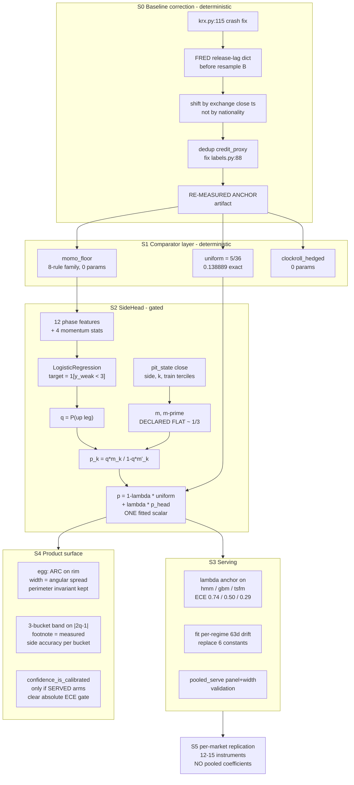

# Kostolany Watch — 차세대 국면 헤드 통합 설계

## 한국어 요약 (전체 본문은 아래 영문)

**생성 과정**: 코드 정독 5레인 → 서로 다른 렌즈의 독립 설계 4개(라벨 재정의 /
패널 풀링 / 보정 우선 / 입력 확충) → 렌즈당 적대 검증자 3인 → **12/12 치명
판정** → 생존 코어만 접붙인 통합안. 총 22 에이전트.

**결정 한 줄**: 6분류를 버리고 **side 전용 헤드(SideHead)** 를 만든다 —
학습되는 것은 로지스틱 회귀 1개 + 보정 스칼라 λ 1개뿐이고, 아래에 **무적합
모멘텀 플로어**(8규칙 중앙값)와 **uniform 확률 플로어**(Brier 5/36)를 깔아
"학습이 무적합보다 못하면 무적합을 쉽한다"를 사전등록된 정상 결말로 둔다.

**핵심 발견 (전부 실측, 메인 루프에서 재검증됨)**:
1. **무적합 규칙(종가>MA60)의 gold-side가 ^GSPC 0.717 / BTC 0.702** —
   서빙 3팔(0.59~0.66)과 phase_head를 8~12%p 이긴다. side 0.575는 상한이
   아니라 결함이었다.
2. **"weak↔gold 일치율이 상한"은 반증** — weak_label 자체의 OOS exact6
   (0.179~0.259)보다 헤드(0.214~0.268)가 높다. 헤드는 선생을 디노이즈한다.
3. **진짜 확률 플로어는 uniform(5/36=0.1389)** — prior_shrunk를 4/4 런에서
   이기고, phase_head도 uniform에는 4/4 패배. 정직한 Brier 여지는 ~0.002뿐.
4. **third|side는 영구 학습 불가** — gold의 3분할은 미래 전환점이 정하는
   경과분율 좌표. 0.372가 상한이며 결정론적 클럭이 공짜로 재현한다.
5. exact6 ≥ 0.29 게이트는 side 0.78을 요구 — **산술적으로 도달 불가, 공식 은퇴**.

**서빙 반영** (연구 산출물이 아니라 화면을 바꾸는 부분):
- 서빙 3팔에 λ-uniform 앵커(~20줄)로 ECE 0.74/0.50/0.29 → ≤0.15 (G14)
- flows의 6개 하드코딩 drift 상수 → 레그블록 CI로 적합; CI가 0을 포함하면
  **평평한 경로 + 명시된 밴드**로 렌더 (사전 결정)
- 달걀: 점 대신 **호(arc)** — 각폭 = 사후분포의 원형 분산
- 신뢰도: |2q−1| 3버킷 + 버킷별 실측 side 적중률 각주

**게이트 (G1~G18 발췌)**: side 패널 중앙값 ≥0.640 · SideHead ≥ 플로어 중앙값
(비열등, z=3.20 Bonferroni 45) · Brier uniform 비열등 · ECE ≤0.060 ·
셔플/as-of/재조정(restatement) 카나리아 3종 전 블록 필수.

**킬 조건**: 플로어에 지면 **플로어를 쉽하고 side.py 삭제** (K2, 사전등록된
정상 결말). uniform에 지면 λ=0으로 uniform 서빙 (K3).

**비용**: ~2,035 LOC, 신규 의존성 0, 전체 실험 45분 내, 8~11일.

---

# Consolidated Architecture Decision (원문)

**Status:** all four designs refuted, 12/12 verdicts fatal. This document grafts what survived refutation and discards the rest permanently.

---

## 1. The decision

We build **a side-only regime head with a declared-flat third factor, anchored below by an unfitted momentum baseline and calibrated against the uniform floor** — `src/kostolany/side.py::SideHead` — and we ship it only after a baseline-correction pass that fixes three measured leaks in the data layer. We **stop claiming**, permanently and in writing: (a) that `weak/gold` agreement is a ceiling — it is refuted by measurement, the heads already beat their own training target by 3.5–30.5% relative on three markets; (b) that `P(third | side)` is learnable — gold's third is `floor(3(t−t0)/(t1−t0))`, an elapsed-bar fraction fixed by a *future* turning point, so no estimator, feature, or label change recovers it; (c) that `prior_shrunk` is the constant to beat — the honest Brier floor is `uniform = 5/36 = 0.138889`, which beats `prior_shrunk` on 4 of 4 measured runs and which **nothing in this repo currently beats**; (d) that exact-6 is the headline metric — it is a product of one learnable factor and one coin flip, and the 0.29 pre-registered gate is arithmetically unreachable; (e) any user-facing forecast skill at 63 days (C6 stands untouched). The single decisive, uncomfortable finding driving all of this: **a two-line unfitted rule, "A2 if close > 60-day MA else B2", scores exact6 0.2384 / side 0.6371 on KS11 with a leg-block CI over the oracle constant of [+0.0007, +0.1201] that excludes zero — beating `phase_head` (0.2140 / 0.5753) and `gbm_shipped` (0.2103 / 0.5534).** The 0.5753 side factor in C1 is not a ceiling; it is a deficiency of roughly 5 percentage points against a baseline nobody had run.

---

## 2. Architecture

### Stage S0 — Baseline correction (deterministic; no statistical gate)

Every published number is measured against a contaminated baseline. Fix first, re-measure, then treat the *new* numbers as the anchor.

| fix | anchor | why |
|---|---|---|
| `or`-on-DataFrame crash | `connectors/krx.py:115` | `_investor_flow_pykrx(start) or _investor_flow_fdr(start)` raises `ValueError: truth value of a DataFrame is ambiguous` the instant `KRX_ID`/`KRX_PW` land, killing `load_market("KS11")` → watch, kospi flows, pooled panel fit. Latent only because the left side returns `None`. |
| FRED release-lag table | `connectors/fred.py:101` | `resample("B").last().ffill()` stamps the June `M2SL` print on 2026-06-01; it did not exist until 2026-07-28. Measured lags: M2SL +57d, CPIAUCSL +43d, FEDFUNDS +30d, UNRATE/PAYEMS +31d, VIXCLS/BAA10Y +1bd, T10Y2Y +0d. `money_proxy` is a `FEATURE_SPECS` member. Static 7-entry dict applied *before* the resample — **not** an ALFRED rebuild. |
| US-close → KS11 same-date join | `connectors/__init__.py:51` | Measured same-date coverage 1.000 against `^KS11`; the 16:00 ET print lands ~6.5h *after* the Seoul close it is attached to. Rule is **exchange close timestamp**, not asset nationality — EWJ/FXI/EEM/EWG/EWU/INDA are US-listed at 16:00 ET and need *no* shift. |
| duplicate feature columns | `features.py:158` vs `:184`; `fred.py:71` | `credit_proxy ≡ −vol_of_vol` exactly (corr −1.0). `credit_spread = vix * 0.05` makes `credit_proxy` and `sentiment_override` perfectly collinear in the no-key path. Two `FEATURE_SPECS` entries are duplicates. |
| B3 drawdown denominator | `labels.py:88` | `/0.5` requires a −50% drawdown for full credit; the A1 comment at `:47-50` documents this exact pathology as already fixed elsewhere. |
| panel duplication | `pooled_forecast.py:25-38`, `:41-49` | `DEFAULT_PANEL` contains both `^GSPC` and `SPY` (ρ≈0.999, zero information, inflates any design effect). `_asset_group`'s substring fall-through routes 16 of 20 equity `SECTORS` to a model that never saw them. |
| stale metadata | `run_phase_experiment.py:447`, `phase.py:34-35` | hardcoded `inner_holdout_rows: 252`; "342 columns" comment (matrix has 23). |

**Output:** a re-measured anchor artifact. If exact6 drops by more than 0.010 after the lag fix, the published 0.2103–0.2222 numbers were partly leak-driven and everything downstream — including `calibration.py` constants — is republished before any promotion.

### Stage S1 — Comparator layer (deterministic; no gate)

The highest-value change in the program. Three arms added to `scripts/run_phase_experiment.py` (registry at `:230-232`, **`gbm_shipped` stays at index 0** — `:307` derives `oos_index` from `preds[candidates[0]]`):

- **`uniform`** — `np.full((n,6), 1/6)`. Brier is exactly `5/36 = 0.138889` for any label distribution (`metrics.py:141` already computes it and it is present in the GSPC/BTC artifacts, never quoted). This becomes the calibration floor.
- **`momo_floor`** — an 8-rule pre-registered family, selection-free: side = `sign(close − MA_w)` for `w ∈ {20,40,60,100,200}` and `sign(ret_h)` for `h ∈ {10,20,60}`; third = the S2 clock. Zero fitted parameters. We score the **median** of the family (primary comparator) and report the **max** (adversarial guardrail).
- **`clockroll_hedged`** — the causal clock carried at the unconditional train-slice survival rate. Zero learned parameters. Its exact6 is never quoted (see §10).

### Stage S2 — `SideHead` (the model; gated)

Two components, and deliberately nothing else.

**Side factor (the only learned discriminative component).**
`LogisticRegression` under log-loss, target `1[y_weak < 3]` (causal weak labels, `labels.py:12-105`). Design matrix = the 12 `DEFAULT_PHASE_FEATURES` (`phase.py:36-49`, all present in the 23-column causally z-scored `model_matrix`) **plus the momentum floor's own statistics** — `close/MA_w − 1` for `w ∈ {20,60,200}` and `z(ret_20)`. Including the floor's statistics is load-bearing: at the shrinkage limit the head reproduces the floor, giving a *structural* non-inferiority argument, not a hoped-for one.

**Third factor (declared flat, deterministic, zero parameters).**
`labels_pit.pit_state(close)` → `(side, k)` where `k` = bars since the last *confirmed* turn. Confirmation reuses gold's own peak test (`labels.py:115-119`) evaluated at `τ = t − 10`, so its furthest read is index `t−1`; declaration lag is exactly 10 bars, never revised. Terciles of `k` fitted on **train rows only**. Emitted probability = the measured train-slice conditional, which will be ≈ 1/3. No `bfill`, no model, no claim.

**6-class probability.**

```
p_k = q · m_k          for k ∈ {A1,A2,A3}
p_k = (1−q) · m'_k     for k ∈ {B1,B2,B3}
```

The C1 factorisation becomes the architecture rather than a post-hoc check. Consequence: `|side × third|side − exact6| = 0` by construction, so **we stop treating the factorisation tripwire as a test** — it is an identity of conditional probability and has measured gap 0.0000 on 27 of 27 candidate-runs already on disk.

**Calibration — exactly one fitted scalar.**

```
p_final = (1−λ)·uniform + λ·p_head       λ ∈ [0,1], 41-point grid
```

`λ` fitted by held-out log-loss on the **weak** target over the inner temporal holdout. One parameter is the most that holdout can support: it contains ~3.3 independent legs (252 bars ÷ ~76 bars/leg), and `PhaseHead`'s *single* existing scalar `kappa_` already varies 1.18–2.12 across KS11 folds fitted on those same rows. At `λ = 0` the head **is** the uniform floor, so downside is bounded by one scalar's estimation error against a target-free anchor.

**Deliberately excluded:** von Mises mixtures, per-row `κ(t)`, Nelder-Mead sharpness fits, isotonic on the ring, Mondrian conformal arcs, pooled ridges with interaction blocks. All were refuted for fitting 7–15 effective parameters on ~3 independent legs.

### Stage S3 — Serving path (this is where every prior design died)

`PhaseHead` has **zero call sites** outside `phase.py`, its tests, and the experiment script. A research artifact changes nothing a user sees. Three concrete serving edits:

1. **`engine.fit_analyst_bundle` (`engine.py:206-252`)** — apply the same one-scalar λ anchor to the three *served* arms. Their measured ECE on ^GSPC is hmm **0.7447**, gbm **0.4956**, tsfm **0.2947** — 1.5× to 3.9× worse than `phase_head`'s 0.1904, and **these are the vectors the UI renders**. ~20 LOC for the largest available calibration win.
2. **`flows.py:50-57 / :494-508`** — the six hardcoded `REGIME_DAILY_DRIFT` constants collapse any 6-vector to one scalar `drift0 ∈ [−0.00055, +0.00055]`, bounding the 3-month terminal call to [−3.27%, +3.38%] at `shock=0.0`. We **fit** the per-regime conditional 63-day drift with a leg-block CI. C6 says that CI will contain zero; when it does, the two prior-driven arms render as **flat paths with a stated band** and the regime stops claiming to move price. That is a product decision made in advance, not a result to be reinterpreted.
3. **`pooled_serve._load_disk` (`pooled_serve.py:59-74`)** — validate `blob["panel"]` and the design width, not just mtime. Any `FEATURE_SPECS` change currently swaps the engine for 20 equity sectors silently for 24h via the bare `except → None` at `flows.py:621`.

### Stage S4 — Egg coordinate and confidence band

**Egg (x, y).** The invariant at `web/src/eggGeometry.ts:1` — *"points live on the outer perimeter, never the barycenter"* — is preserved. Position stays `pointOnRim(ang)` from `rimFromProba(probabilities)`, unchanged. What changes is that we render an **arc, not a point**: angular extent = the posterior's circular spread. An uninformative bar becomes a wide arc spanning most of the ring instead of a confident label. This achieves what the entropy-radius proposal wanted without violating the chart's stated rule. The dead backend `egg: {x,y}` (`engine.py:110`, typed at `web/src/api.ts:17`, never read) is either wired or deleted — not left computed-and-ignored.

**Confidence band.** Three buckets on side conviction `|2q − 1|`, with a footnote stating the **measured OOS side accuracy per bucket**. Never a 6-class probability number. `calibration.py:112 confidence_is_calibrated` flips to `true` only when the **served** arms clear the absolute ECE gate in §6 — never on the strength of a research head.

### Stage S5 — Breadth as replication, not as power

Run `SideHead` **independently per market** (no shared coefficients) on 12–15 instruments. The measured ICC of the paired delta, +0.0158, is the *correct* estimate for independent fits; it is not valid for a pooled estimator, where a single realisation of shared-coefficient error is common-mode and the correlation grows monotonically toward 1 in the pooling limit. Report a sign test with duplicates collapsed and Bonferroni applied.



---

## 3. Which factor moves, and by how much

C1's identity `exact6 = side × P(third | side)` holds exactly (gap 0.0000, 27/27 runs). We move exactly one of the two factors, plus calibration.

### Side — the entire accuracy story

| step | value | source | claim type |
|---|---|---|---|
| shipped `phase_head` | **0.5753** | KS11 artifact | — |
| shipped `gbm_shipped` | 0.5534 | KS11 artifact | — |
| `sign(ret_20)`, unfitted | 0.6209 OOS / 0.6309 full | verifier measurement | free |
| `sign(close/MA100 − 1)`, unfitted | 0.6079 | verifier measurement | free |
| `close > MA60`, unfitted | **0.6371** | verifier measurement, n=2819, 37 legs | free |
| `momo_floor` **median of 8-rule family** | ≈ 0.58–0.62 *(to be re-measured on the identical scored index)* | Step 2 output | the comparator |
| `SideHead` target | **floor_median + 0.015**, and ≥ floor_max − 0.005 | this design | modelling |

Two separate movements, and they must never be reported as one number:

- **Free correction:** `0.5753 → ~0.6371`, i.e. **+0.062**, obtained with zero fitted parameters. Identifiable at the panel level with Bonferroni correction (§4). This is a *baseline error*, not a model gain.
- **Modelling contribution:** `floor → floor + 0.015`, i.e. **+0.008 to +0.015**. **Not identifiable** at any panel size we can build (§4). Pre-registered as a non-inferiority claim only.

Cross-market context that kills C1's framing as a law: side accuracy across 15 instruments spans **0.5593 (HYG) to 0.6890 (BTC)**, macro-average 0.6237, with **KS11 the worst in the panel at 0.5753**.

### `P(third | side)` — permanently null

`0.3720 → 0.3720`. Declared unlearnable and never targeted again. `labels.py:156-159`: `seg = px.loc[t0:t1]`, `cuts = np.array_split(seg.index.to_numpy(), 3)`. A bar's third is `floor(3·(t−t0)/(t1−t0))` — a positional coordinate whose denominator is the leg length `L`, fixed by a turning point strictly in the future. Causally you know the elapsed `k`; you cannot know `L`. The measured 0.3720 vs the 1/3 coin flip is *exactly* the weak prior elapsed time supplies, which the S2 clock reproduces deterministically at zero parameters. Guardrail: the clock's `third|side` must land in **[0.355, 0.385]**; above 0.40 indicates a leak, below 0.34 indicates a broken clock.

Corroboration that this is not a modelling failure: the *training target itself* scores `third|side` = **0.3005 on ^GSPC — below the 1/3 chance floor** — while `phase_head` gets 0.3717. Transfer from teacher to head on this factor has three different signs across three markets (KS11 +0.031, GSPC +0.071, BTC −0.021). There is nothing there.

### Exact6 — derived, not targeted

| arm | side × third\|side | exact6 |
|---|---|---|
| `gbm_shipped` | 0.5534 × 0.3800 | 0.2103 |
| `phase_head` | 0.5753 × 0.3720 | 0.2140 |
| 14-rule family **median**, unfitted | — | **0.2167** |
| `close > MA60`, unfitted | 0.6371 × 0.3742 | **0.2384** |
| `SideHead` target | 0.635 × 0.372 | **0.2362** |

Note the shape of this table: the median of fourteen arbitrary unfitted rules already exceeds both shipped heads. Exact6 is reported for continuity and is no longer the promotion metric.

### Calibration — the deterministic win, correctly anchored

| quantity | value | note |
|---|---|---|
| `uniform` Brier | **0.1388889** | `= 5/36` exactly, invariant to label distribution (`metrics.py:141`) |
| `prior_shrunk` Brier | 0.1414 / 0.1414 / 0.1438 / 0.1502 | loses to uniform on **4 of 4** runs, mean −0.00531 |
| `phase_head` Brier | 0.1501 / 0.1457 / 0.1511 / 0.1412 | loses to uniform on **4 of 4**: +0.0112 / +0.0068 / +0.0122 / +0.0023 |
| `SideHead` primary | **≤ 0.1389** (non-inferiority, CI upper < +0.0010) | vs `uniform` |
| `SideHead` secondary | **0.1369** (superiority) | arithmetic below |

Superiority arithmetic, on the repo's own convention (`brier = mean over classes of MSE`, i.e. `Σ_k / 6`): under `p_k = q·m_k` with flat thirds, side resolution contributes `(Σm² + Σm'²)·Var(q)/6 = Var(q)/9`. At calibrated side accuracy 0.635 with two-point `q ∈ {0.635, 0.365}`, `Var(q) = 0.0182` → gain **0.00203**. Hence `0.13889 − 0.00203 = 0.13686`. **The entire honest Brier headroom over a data-free constant is ~0.002.** Any design claiming more is not reading these numbers.

ECE: `0.1904 → ≤ 0.060` leg-blocked. This is the best-identified claim in the program: measured ECE deltas run 3–5× their CI half-widths on a single market.

### Label

**No change to `weak_labels`.** The C2 ceiling framing is retired by measurement:

| market | `weak_label` exact6 | `phase_head` exact6 | retention |
|---|---|---|---|
| KS11 | 0.1925 | 0.2140 | **1.112** |
| ^GSPC | 0.1786 | 0.2330 | **1.305** |
| BTC-USD | 0.2590 | 0.2681 | 1.035 |

The heads already *beat* their training target on gold. There is no 0.23 cap. What survives from C2: target mismatch is a systematic **bias** in any calibration fitted on weak and scored on gold — which is precisely why `λ` is anchored to `uniform`, a target-free object, rather than to `prior_shrunk`, a weak-marginal object.

---

## 4. Statistical plan

**Unit of independence.** The leg (`phase.gold_leg_segments`, a maximal same-side run of gold). Measured length 71–77 bars across four artifacts. **Not** 126-bar epochs: legs straddle epoch boundaries, so within-epoch leg resampling fragments them and understates variance by ~√(76/21) ≈ 1.9× — the exact failure `run_phase_experiment.py:6-7` was written to avoid.

**Blocking scheme.** Two-level paired cluster bootstrap, 2000 replicates, seed 20260729, **shared draw matrix** across candidates so common fold/leg variance cancels (the `boot_samples[a] − boot_samples[b]` element-wise construction at `:399`). Outer level: instrument. Inner level: leg within instrument. The current implementation at `:376-381` is a **flat single-level pooled resample with no symbol stratum** — this must be replaced before any panel claim is quoted; using it as-is produces CIs ~1.5× too narrow.

**Effective instruments.** Nominal 15 collapse to ~10 distinct factors under a pre-registered map: `{^GSPC, SPY}`, `{IWM, ^RUT}`, `{EWY, KS11}`, `{SHY, IEF, TLT}`, `{^NDX, XLK}`, `{RSP ~ SPY reweight}`. The collapse map is frozen before the run.

**Effective sample size.** Measured ICC of the paired delta = +0.0158 (mean pairwise +0.0236) — but from T=24 epochs, so the SE of a single pairwise correlation is `1/√23 = 0.209` and of the mean ≈ 0.07. The 95% upper bound on ρ is ≈ 0.16 (delta) / 0.22 (side level). We therefore plan across the range, not the point:

| ρ | DEFF at N=10 | n_eff legs (from ~380 raw) |
|---|---|---|
| 0.016 | 1.14 | 333 |
| 0.079 (measured, side level) | 1.71 | 222 |
| 0.22 (95% upper) | 2.98 | 128 |

**Comparator.** `momo_floor` (median of the 8-rule family), scored on the **identical** OOS index, paired on the identical resampled leg set. Secondary comparators: `uniform` for Brier/ECE, `momo_floor` max-of-family as an adversarial guardrail, `phase_head` and `gbm_shipped` for continuity.

**Multiple-comparison correction.** Approximately **45 variants have already been scored on this exact origin** (same folds, same seed, same gold). Bonferroni at 45 → **z = 3.20** for all primary hypotheses (α = 0.05/45). The pre-registration file is committed with a git SHA before the run; the collapse map, fold geometry, comparator set, and every threshold in §6 are frozen in it.

**Minimum detectable effect.** Per-leg paired-delta sd is **0.185**, derived from the measured `trivial − oracle_constant` CI half-width 0.0597 on 37 legs (SE 0.0305 → 0.0305 × √37).

| scope | n_eff | SE | uncorrected MDE (80% power) | Bonferroni MDE (z=3.20) |
|---|---|---|---|---|
| KS11 alone | 35 | 0.0313 | 0.088 | **0.126** |
| panel, ρ=0.22 | 128 | 0.0164 | 0.046 | **0.066** |
| panel, ρ=0.079 | 222 | 0.0124 | 0.035 | **0.050** |

**What this identifies and what it does not:**

- **IDENTIFIABLE (panel, Bonferroni-corrected):** the momentum-floor correction, `+0.050 to +0.062`. This is the primary claim and it clears the corrected MDE at ρ ≤ 0.079 and sits at the edge at ρ = 0.22.
- **NOT IDENTIFIABLE:** `SideHead` minus `momo_floor`, predicted `+0.008 to +0.015`. Detecting +0.010 at Bonferroni needs SE ≈ 0.0031 → **n_eff ≈ 3,560 legs → ~90 effective independent instruments.** That experiment does not exist at any panel we can assemble. It is pre-registered as a **non-inferiority** claim only, and any point estimate in `(0, +0.015)` is reported as *NOT IDENTIFIED*, never as a gain.
- **NOT IDENTIFIABLE, PERMANENTLY:** any KS11-specific claim. 35 legs is structural under the current gold definition (max OOS 2,701 bars). KS11's paired SE stays ≈ 0.031 forever.
- **WELL IDENTIFIED:** ECE on a single market (measured deltas 3–5× their CI half-widths); Brier non-inferiority against `uniform` (a fixed constant with zero sampling variance, so only the head's own variance enters).

---

## 5. Data program

Every block enters the **feature channel only**. Nothing enters `labels.py`. Rationale: the label rewrite proposal was refuted on the ground that its 81%-of-gain mechanism targeted an elapsed-bar coordinate no exogenous series can forecast, and its gate was a gold-computed statistic on unpurged full history selecting the training target.

| block | series | retrieval | publication lag / alignment | status |
|---|---|---|---|---|
| **LAG** | existing FRED panel | none (on-disk parquet) | measured: M2SL +57d, CPIAUCSL +43d, FEDFUNDS +30d, UNRATE/PAYEMS +31d, VIXCLS +1bd, BAA10Y +1bd, T10Y2Y +0d | **audit, S0** |
| **CS** | `Δ60 log(HYG/LQD)`, `Δ60 log(^VIX/^VIX3M)`, `Δ60 log(RSP/SPY)`, `Δ60 log(XLY/XLP)` | one bulk `yf.download`, 4.9s measured, cached `crosssec_v1_{start}.parquet`, 24h TTL | all 16:00 ET close. Same-date for US symbols; `shift(1)` only for genuinely Seoul-closing series | experiment |
| **KR** | `Δ60 log(EWY/^KS11)`, `Δ60 log(KRW=X)` | same call | EWY is US-listed 16:00 ET; `^KS11` is 15:30 KST. Pair is cross-timezone → `shift(1)` mandatory | experiment |
| **AMT** | KOSPI `Amount` (KRW turnover) | already fetched and **discarded** at `krx.py:28,33` | same bar, no lag | deterministic, one line |
| **FLOW** | signed KRX net-buy `외국인합계 / 기관합계 / 개인` | `pykrx`, credential-gated | KRX MDC [12008] publishes T provisionally ~15:40 KST, final ~18:00 KST, after the 15:30 close → `shift(1)` mandatory | **inert today** |

Depth check: binding constraints are `HYG` (2007-04-11) and `^VIX3M` (2006-07-17), both clearing `data_start = 2010-01-01` with 2.5+ years of warm-up.

**FLOW is inert and ships as dead code behind a credential check.** `pykrx` 1.2.8 gates every `data.krx.co.kr` endpoint on `KRX_ID`/`KRX_PW` (`auth.py:8-10`), and `dataframe_empty_handler` swallows the failure into an empty frame so `krx.py:65`'s `except` never fires. Proof on disk: `artifacts/cache/krx_ks11_2010-01-01.parquet` is 4,079×5 OHLCV with **zero extras columns**. The `.abs()` removal at `krx.py:83/85` is correct and should land, but it will change no model output until credentials exist. The crash fix at `:115` is urgent and independent.

### Three mandatory safeguards per block

1. **Circular-shift shuffle canary.** Shift the block's series by a random offset in [250, 1750] bars (preserves marginal and autocorrelation exactly, destroys date alignment), 20 draws. Reject the block if the median shuffled effect exceeds **25%** of the true effect, or if the 5th–95th shuffled envelope contains the true effect. Threshold tightened from the 40% originally proposed — 40% pre-authorises nearly half the observed gain to be a smoothing artifact.
2. **As-of reversal.** Re-run with the block's availability moved one day earlier. Reject if the effect improves by more than one paired SE. **Corrected expectation table:** cross-timezone pairs (KR block on KS11) must show improvement near the rejection threshold, confirming the shift removed a real look-ahead; same-timezone pairs (CS block on US symbols, including EWJ/FXI/EEM/EWG/EWU/INDA which are US-listed) must show |difference| below one paired SE. The prior design's expectation table was falsified precisely here.
3. **Restatement canary (new; neither prior design had it).** Re-fetch the block at two wall-clock dates ≥7 days apart and assert historical values are bit-identical. `auto_adjust=True` (`data.py:24`) back-adjusts every historical close on each ex-dividend, so **levels fail this test by construction** — a 2015 bar sees the 2026 restatement. This is why every CS/KR series is specified as a 60-bar log-ratio **change**, never a level, and the canary pins it. Neither the shuffle canary (which preserves restatement) nor the as-of reversal (one-day) can detect this.

---

## 6. Pre-registration

Committed to `artifacts/prereg/side_head_v1.json` with a git SHA **before any run**. Comparator is always re-measured in the same process, on the same folds, with the same bootstrap draw matrix — never copied from an artifact measured on a different feature set.

### First: re-register the absolute serving bar, in the open

The prior bar (`docs/PHASE_HEAD_RESULT_2026-07-29.md:33-34`: exact6 ≥ 0.29, adjacent ≥ 0.74, cyc_dist ≤ 1.02, ECE ≤ 0.07, Brier ≤ 0.134) failed 5/5 and was measured under the old gold definition. **We formally retire exact6 ≥ 0.29 as arithmetically unreachable**: with `third|side` pinned at 0.372 it requires side = 0.29/0.372 = **0.780**, far outside anything measured anywhere in this project (panel max 0.6890 on BTC). Replacing a failed absolute gate with an easier relative one is the repo's own documented prior failure; we replace it with a *reachable absolute* gate instead, decided now.

| # | hypothesis | threshold | comparator | test | corrected α |
|---|---|---|---|---|---|
| **G1** | side accuracy, panel median | **≥ 0.640** | absolute | point estimate | — |
| **G2** | side, `SideHead` − `momo_floor(median)` | **≥ 0.000**, CI lower > −0.010 | `momo_floor` median-of-8 | paired 2-level cluster bootstrap | z = 3.20 |
| **G3** | side, `SideHead` − `phase_head` | **≥ +0.050**, CI excludes 0 | `phase_head` re-measured | paired 2-level cluster bootstrap | z = 3.20 |
| **G4** | Brier, `SideHead` − `uniform` | CI upper **< +0.0010** (non-inferiority) | `uniform` = 0.138889 | paired bootstrap | z = 3.20 |
| **G5** | Brier superiority (secondary) | point **≤ 0.1369**, CI upper < 0 | `uniform` | paired bootstrap | z = 3.20 |
| **G6** | leg-blocked ECE, panel median | **≤ 0.060**, and ≤ 0.10 on ≥ 10 of 12 | absolute | per-market | — |
| **G7** | exact6, panel median | **≥ 0.235** | absolute (chance 0.1667) | point estimate | — |
| **G8** | adjacent, panel median | **≥ 0.620** (floor 0.500) | absolute | point estimate | — |
| **G9** | cyclic distance, panel median | **≤ 1.240** | absolute | point estimate | — |
| **G10** | clock `third\|side` | in **[0.355, 0.385]** | 1/3 chance | sanity band | — |
| **G11** | `SideHead` beats `momo_floor` max-of-family on side | **not worse by > 0.010** | adversarial guardrail | paired | — |
| **G12** | S0 lag-fix regression | exact6 drop **≤ 0.010**; if exceeded, republish all downstream artifacts before promoting anything | pre-S0 anchor | audit | — |
| **G13** | prefix stability of `pit_state` | **500/500** random `(s,t,t')` triples per symbol | formal causality definition | property test in `agent_verify.py` | — |
| **G14** | served-arm ECE after λ anchor | **≤ 0.15** on hmm, gbm, tsfm | current 0.7447 / 0.4956 / 0.2947 | per-arm | — |
| **G15** | shuffle canary, every block | median shuffled effect **< 25%** of true | self | 20 circular draws | — |
| **G16** | as-of reversal, every block | improvement **≤ 1 paired SE** | self | one-day reversal | — |
| **G17** | restatement canary, every block | historical values **bit-identical** across two fetches ≥7d apart | self | direct comparison | — |
| **G18** | leakage hard stop | `gold_used_for_training: false`; zero `LeakageAuditor` critical findings; `scripts/agent_verify.py` passes; Korean disclaimer on every touched surface | C7 | assertion | — |

**Explicitly declared unidentifiable in advance (reported, never a gate):** G2's point estimate above zero. Any value in `(0, +0.015)` is written into the artifact as *NOT IDENTIFIED — below the Bonferroni-corrected MDE of 0.050*, and is never upgraded to a win.

**Explicitly retired as tests:** the C1 factorisation tripwire (an identity of conditional probability; gap 0.0000 on 27/27 runs, cannot fail); `n_legs < 40` as a banner (replaced by reporting `n_eff` with a ρ confidence interval).

---

## 7. Kill conditions

| # | trigger | consequence |
|---|---|---|
| **K1** | **G3 fails** — `SideHead` does not beat `phase_head` on side by ≥ 0.050 with a corrected CI excluding zero | The momentum-floor finding does not replicate on the panel. Stop. The KS11 measurement was a single-market artifact. |
| **K2** | **G2 fails** — `SideHead` is worse than the unfitted momentum median | **Ship `momo_floor` as the head.** Delete `side.py`. State publicly that the regime head contains no fitted model. This is a pre-registered acceptable outcome, not a failure — the momentum statistics are already in the design matrix, so a loss here means the logistic is overfitting and should be removed. |
| **K3** | **G4 fails** — Brier is worse than `uniform` | The probability layer has no content. Ship `uniform` as the served posterior (`λ = 0`, which the architecture supports exactly), keep the head for the ordinal call only, and set `confidence_is_calibrated = false` permanently. |
| **K4** | **G13 fails on any triple**, or any `LeakageAuditor` critical finding | Hard stop. Revert the branch. No negotiation (C7). |
| **K5** | **G15/G16/G17 fail for a block** | Drop that block. The design survives; the block was perturbation, misalignment, or restatement, not information. |
| **K6** | **G12 exceeds 0.010** | Does not kill this design — kills the *baseline*. Every published number including `calibration.py` constants is republished first, and that becomes the priority work. |
| **K7** | **G14 fails** — the λ anchor does not fix the served arms' ECE | The 0.7447 / 0.4956 ECE is not a calibration problem but a model problem. Remove the confidence band from the UI entirely rather than render a miscalibrated one. |
| **K8** | Panel side accuracy median < 0.600 after S0 | The momentum-floor effect does not survive the leak fixes, meaning it was partly riding the same-date US→KS11 look-ahead. Stop and report. |

**If K1 and K2 both fire, the product becomes:** the Kostolany egg as a *state description* driven by an unfitted trend rule, with a `uniform`-anchored posterior, a three-bucket confidence band whose footnote states the measured side accuracy, and a 3-month path that is a flat line with a stated band because C6 measured 63-day direction skill at zero. That is a smaller product than the current one claims to be, and a more honest one. It is an acceptable terminal state.

---

## 8. Build order

Deterministic steps (D) need no statistical gate — they are bug fixes with tests. Experiments (E) are gated by §6.

| # | step | type | files | LOC | depends on |
|---|---|---|---|---|---|
| 1 | `or`-on-DataFrame crash | **D** | `connectors/krx.py:115` | 5 | — |
| 2 | FRED release-lag dict before `resample("B")`; kill `credit_spread = vix*0.05` | **D** | `connectors/fred.py:71,101` | 45 | — |
| 3 | shift-by-exchange-close-timestamp rule | **D** | `connectors/__init__.py:51`, `connectors/crosssec.py` | 60 | — |
| 4 | dedup `credit_proxy`/`vol_of_vol`; fix `labels.py:88`; fix `DEFAULT_PANEL` duplicate; fix `_asset_group`; stale metadata | **D** | `features.py`, `labels.py`, `pooled_forecast.py`, `run_phase_experiment.py:447`, `phase.py:34-35` | 70 | — |
| 5 | **Re-measure the anchor** (G12 audit) | **E** | `scripts/run_phase_experiment.py` | 0 | 1–4 |
| 6 | `labels_pit.py` + prefix-stability property test wired into `agent_verify.py` | **D** | new `src/kostolany/labels_pit.py`, `tests/test_labels_pit.py`, `scripts/agent_verify.py` | 200 + 120 | — |
| 7 | Comparator arms: `uniform`, `momo_floor` (8-rule family), `clockroll_hedged` | **D** | `scripts/run_phase_experiment.py:230-287` | 90 | 6 |
| 8 | Two-level paired cluster bootstrap + ICC/DEFF/`n_eff` reporter replacing the flat resample | **D** | new `src/kostolany/harness/panel_bootstrap.py`, `run_phase_experiment.py:376-408` | 140 | — |
| 9 | `metrics.py`: leg-blocked ECE, side-Brier, ring-CRPS (circular Wasserstein-1) | **D** | `harness/metrics.py` | 80 | — |
| 10 | **Establish the momentum floor** on the corrected anchor (this fixes the comparator for everything after) | **E** | — | 0 | 5, 7, 8 |
| 11 | `SideHead` (S2) | **E** | new `src/kostolany/side.py`, `tests/test_side.py` | 280 + 150 | 6, 7 |
| 12 | CS + KR + AMT blocks with all three canaries | **E** | new `connectors/crosssec.py`, `features.py`, `krx.py:28,33` | 190 | 3 |
| 13 | Panel runner: 12–15 markets, independent fits, collapse map, sign test, Bonferroni | **E** | new `scripts/run_side_panel.py` | 260 | 8, 10, 11 |
| 14 | λ anchor on the **served** arms (G14) | **E** | `engine.py:206-252` | 25 | 11 |
| 15 | Fit per-regime 63-day drift with CI; flat-path fallback | **E** | `flows.py:50-57,494-508`, new harness eval | 120 | 14 |
| 16 | `pooled_serve` panel + design-width validation | **D** | `pooled_serve.py:59-74` | 30 | — |
| 17 | Egg arc rendering; 3-bucket band; per-bucket accuracy footnote; wire-or-delete backend `egg` | **E** | `web/src/EggChart.tsx`, `engine.py:110`, `web/src/api.ts` | 130 | 14 |
| 18 | `calibration.py` refresh; `confidence_is_calibrated` conditional on G6+G14 | **D** | `calibration.py` | 40 | 14, 17 |

**Total ≈ 2,035 LOC across 6 new and 14 touched files.** No new dependency, no image-size change (`sklearn` `LogisticRegression` is already resident; there is no von Mises machinery to add).

**Compute.** `LogisticRegression` on 16 columns is comparable to `PhaseHead`'s measured 0.01s/fold. Panel of 12 × 8 folds ≈ 2 minutes excluding data load; `gbm_shipped` continuity arms add ~34s per market and run on KS11/^GSPC/BTC only. Bootstrap: 2000 replicates × 6 candidates ≈ 60s (measured 0.49s per candidate per 1000 replicates on 2,696 rows). Shuffle canaries: 20 draws × 3 blocks ≈ 25 min serial, ~4 min on 8 workers. **Full program under 45 minutes.**

**Wall clock: 8–11 engineer-days.** Steps 1–4 are day 1 and ship independently of every approval. Step 5 is the highest-information single day in the program — it can invalidate the published baseline, and that outcome is more valuable than any model result here.

**Sequencing note:** step 1 is urgent regardless of whether anything else is approved. It is latent only because credentials are absent, and it takes down KS11 entirely the moment they arrive.

---

## 9. What this design cannot do

- **`P(third | side)` — permanently unreachable.** Gold's third is `floor(3(t−t0)/(t1−t0))` with `t1` a future turning point. Not a modelling gap; a definitional one. 0.372 is the ceiling and it is the elapsed-time prior. Corroborated by the training target scoring **0.3005 — below chance** — on ^GSPC.
- **exact6 ≥ 0.29 — arithmetically unreachable.** Requires side = 0.780; panel maximum ever measured is 0.6890 (BTC), KS11 is 0.5753. We retire the gate rather than reinterpret it.
- **`SideHead` minus `momo_floor` — unidentifiable at any buildable panel.** Detecting +0.010 at Bonferroni-corrected α needs ~3,560 effective legs ≈ 90 effective independent instruments. We can assemble ~10.
- **Any KS11-specific significance claim.** 35 legs is structural (max OOS 2,701 bars under the current gold definition). KS11's paired SE stays ≈ 0.031 permanently. All claims are panel-level with KS11 as one instrument.
- **Brier superiority over a data-free constant beyond ~0.002.** The arithmetic is closed-form: side resolution = `Var(q)/9` on the 6-class convention, capped at `(a − 0.5)²/9` for a calibrated forecaster with accuracy `a`. At `a = 0.635` that is 0.00203. There is no more.
- **Beating `prior_shrunk`'s ECE of 0.0442.** A near-constant predictor always has near-zero ECE. We do not claim it and we do not treat it as evidence of skill — that is the exact error the existing artifact already warns about.
- **63-day direction skill.** C6 stands untouched: hit rate minus the majority-direction baseline is in [−0.051, +0.009] across KS11/^GSPC/BTC, with negative magnitude-vs-realised correlation on two of three. Nothing here changes it, and step 15 is designed to *report* that fact rather than paper over it.
- **Input degeneracy (C4).** The CS/KR blocks add roughly one global risk-appetite factor to a rank-5.6 matrix. `Δ60 log(RSP/SPY)`, `Δ60 log(HYG/LQD)` and inverted VIX term structure are largely one factor, and it is partly collinear with `trend_slope`. Genuinely new *measurement* — KRX signed flows, KRX constituent breadth — requires credentials this design deliberately does not depend on.
- **Serving the 14 `SECTORS` outside the panel any better than a per-market refit.** Because we refuse pooled coefficients, each served symbol needs its own fit or falls back to the momentum floor. That is stated, not hidden.

---

## 10. Refuted claims we are NOT carrying forward

| # | claim | origin | why it died |
|---|---|---|---|
| 1 | "weak/gold agreement 0.219–0.230 is a ceiling; heads are at 92–97% of it" | C2 / infoflow | Refuted by measurement. `weak_label` OOS exact6 0.1925/0.1786/0.2590 vs `phase_head` 0.2140/0.2330/0.2681 — retention 1.112/1.305/1.035. Heads denoise their teacher. The "0.951 retention" was manufactured by dividing an OOS metric by a full-history statistic. |
| 2 | "`prior_shrunk` is the constant to beat" | shipped artifacts / calib | `uniform = 5/36 = 0.138889` beats `prior_shrunk` on 4/4 runs (mean −0.00531). `phase_head`'s only "win over a constant" (BTC, −0.0090) is `prior_shrunk` being bad there (0.1502, ECE 0.1992), not the head being good. Against `uniform`, `phase_head` loses 4/4. |
| 3 | "PIT-6 label lifts exact6 from 0.2140 to 0.63" | label | Tautology. CLOCKROLL exact6 ≡ P(no turn declared in the window) = 0.6310 = 1 − 0.364. It is a free dial: 0.4280/0.5839/0.6310/0.6938/0.7252/0.7802/0.8508 at min_gap 20/30/40/50/60/80/120, and min_gap is fold-selected. At the product's own horizon (h=63, `flows.py:20`) it measures **0.0551**, three times worse than the 0.1667 chance floor. |
| 4 | "Turn-hazard AUC ≥ 0.58 is a meaningful gate" | label | Measured AUC = **0.900** from the clock feature `k` alone, because min_gap=40 forces P(turn) ≡ 0 for k < 29 — 921 of 2798 bars with exactly zero events. A third of the AUC is an arithmetic identity imposed by the label's own hyperparameter. |
| 5 | "P4 Brier ≤ 0.105 proves the hazard head has content" | label | Passed by `clockroll_hedged`, zero learned parameters, closed-form Brier **0.09577**. The design named that comparator in prose and omitted it from every gate. |
| 6 | "24-symbol binomial sign test, 18/24 ⇒ p = 0.011" | label / panel | `{SPY,^GSPC}`, `{IWM,^RUT}`, `{EWY,KS11}`, `{SHY,IEF,TLT}`, `{^NDX,XLK}` collapse 24 symbols to ~5–6 independent factors. 18/24 maps to ~4.5/6, p ≈ 0.34. Also: the turn-hazard target is the quantity *most* synchronised across equities. |
| 7 | "ICC +0.0158 ⇒ DEFF 1.221 ⇒ 12.9× variance reduction for a pooled head" | panel | The ICC was measured on **independent per-symbol fits** (`res[s] = run_one(s)`, no shared parameter anywhere). Under a shared `beta_shared`, per-instrument deltas are correlated **by construction**, growing to 1 in the complete-pooling limit — the error has the wrong *sign* for the only hypothesis it sizes. At ρ=0.5, n_eff ≈ 69 legs and the predicted +0.0133 is 0.6σ. |
| 8 | "Hierarchical kappa gives per-instrument confidence heterogeneity" | panel | `phase.py:157` fixes `inner_holdout = 252`, so with the proposed pseudo-count m=252 the shrinkage is exactly `0.5·kappa_i_raw + 0.5·kappa_0` — **half** the heterogeneity of the per-market comparator, not more. Argument also inverted: exposing genuine confidence variation *raises* ECE when the confidence is wrong. |
| 9 | "A rotated constant-width bump mathematically cannot beat a constant on a proper score" | calib | False. Murphy resolution is between-bin variance of *outcome frequencies*, not variance of forecast sharpness. exact6 = 0.2140 > 0.1667 proves the rotation is informative, so resolution is strictly positive. The whole "headroom lives in reliability" chain rests on this. |
| 10 | "d_brier is monotone in ECE, slope 0.25 Brier/ECE" | calib | Not monotone on its own four points (GSPC ECE 0.2071 → +0.0073 vs KS11 ECE 0.1904 → +0.0087, inverted). Refit against `uniform` drops the slope from 0.200 to 0.118 — 41% was comparator variance. n=3 markets, extrapolated 55% outside the observed ECE support. |
| 11 | "Per-row κ(t), isotonic, and Mondrian conformal fitted on the inner holdout" | calib | 252 bars ÷ ~76 bars/leg = **3.3 independent legs** for 7+ effective parameters plus a nonparametric curve. `PhaseHead`'s *single* existing kappa already varies 1.18–2.12 across folds on those same rows. 80% Mondrian split-conformal needs n ≥ 4 per stratum; it would have ~1.6. |
| 12 | "Entropy-radius egg puts uninformative bars at the centre" | calib | `web/src/eggGeometry.ts:1` states the invariant: *"points live on the outer perimeter, never the barycenter."* Also, `engine.py:110`'s backend `egg: {x,y}` is already computed, typed, and **never read** — `EggChart.tsx:52` recomputes client-side. |
| 13 | "Activate the dead `money` gauge in the weak-label prototypes" | infoflow | 81% of the claimed gain targeted `third|side`, which is an elapsed-bar tertile no exogenous series forecasts. The proposed sign table is also degenerate at exactly the two side-flip points: A1 = B3 and A3 = B1 in the money terms. |
| 14 | "P1 (Δ weak/gold agreement) is a valid decisional gate" | infoflow | It is a **gold-computed statistic on unpurged full history that selects the training target**. Gold is future-looking on four axes (`labels.py:116-117`, `:118-119`, `:155-167`, `:169`). The letter of C7 holds; the substance is the HSMM failure mode relocated one level up. Also: no established monotone transfer to any shipped metric — the observed coefficient is >1 and non-constant. |
| 15 | "`.shift(1)` EWJ/FXI/EEM because the US close postdates the Seoul close" | infoflow | EWJ, FXI, EEM, EWG, EWU, INDA are **US-listed ETFs** with a 16:00 ET close. They have no Seoul close. The availability table was built by asset nationality, not by comparing exchange close timestamps — the same reasoning error as the bug it claimed to fix. |
| 16 | "Shuffle canary + as-of reversal are sufficient safeguards" | infoflow | Both are blind to `auto_adjust=True` restatement: a 2015 bar sees the 2026 back-adjusted value. Circular shift preserves it; a one-day reversal cannot see it. Hence the mandatory third canary in §5. |
| 17 | "The C1 factorisation tripwire is a binding test" | all four | `exact6 ≡ P(side)·P(third|side)` is the definition of conditional probability. Measured gap 0.0000 on **27 of 27** candidate-runs. It can never fail and gates nothing. |
| 18 | "P5/S2 gates measured on KS11 alone" | label / infoflow | 35 legs, measured leg-block CI half-width ~0.035–0.040. Thresholds of 0.0100 sit 4× below the noise floor. Any KS11 point estimate against a sub-0.04 threshold is not a test. |
| 19 | "A research artifact passing its gates constitutes promotion" | panel / calib | `grep PhaseHead src/kostolany/{engine,api,flows,models}.py` returns zero. `flows.py:494-508` collapses any 6-vector to `drift0 ∈ [±0.00055]`, bounding the on-screen 3-month call to [−3.27%, +3.38%]. Calibration gains are invisible through a 3-bucket band. Every design that budgeted zero lines for `engine.py`/`flows.py`/`api.py` was shipping nothing. |
| 20 | Pretrained TSFM arms; HSMM/sticky HDP-HMM; full ALFRED vintage rebuild; CFTC COT / put-call; LLM narrative layer | prior rejections | Unchanged and not re-proposed. Nothing in this design adds pretrained weights, a duration state-space, a vintage database, a weekly series, or an LLM. |

---

**Files that will carry this work:** `C:\Users\ikess\Workspace\lionandthelab\kostolany-watch\src\kostolany\side.py` (new), `...\src\kostolany\labels_pit.py` (new), `...\src\kostolany\connectors\crosssec.py` (new), `...\src\kostolany\harness\panel_bootstrap.py` (new), `...\scripts\run_side_panel.py` (new), `...\artifacts\prereg\side_head_v1.json` (new, committed with git SHA before any run).